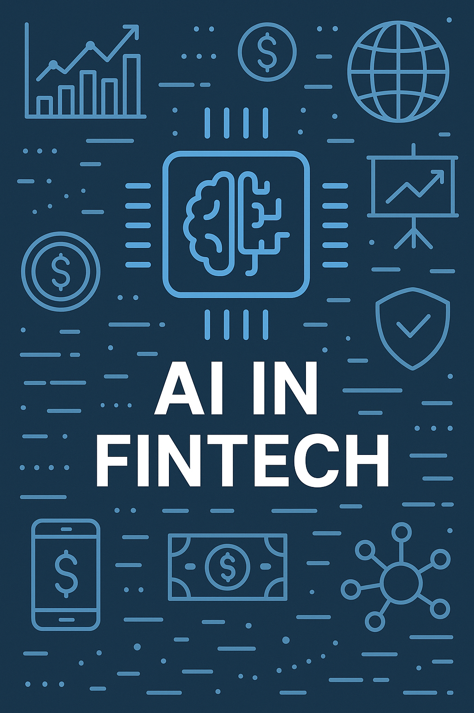

<!-- Banner Image -->

  

### 🚀 About Me

As a dedicated PhD candidate at [Politecnico di Milano](https://www.polimi.it/), specializing in **Reinforcement Learning** and **Artificial Intelligence in Trading**, I am passionate about pushing the boundaries of financial technology.

🔍 My research focuses on using advanced **Deep Learning** and **RL** techniques to develop intelligent trading systems.  
📈 I’m fascinated by the intersection of **Finance** and **AI**, and I'm working to contribute to the next generation of trading strategies.  
🤝 Let's connect and explore the exciting realms of AI-driven finance together!

---

### 🧠 Tech Stack & Skills

- 💻 **Languages**: Python (main), R, MATLAB  
- 🧠 **AI/ML**: TensorFlow, PyTorch, Keras  
- 🔁 **Reinforcement Learning**: DQN, PPO, A3C, custom agents  
- 📊 **Finance Tools**: pandas, NumPy, TA-Lib, backtrader  
- ⚙️ **Others**: Git, Jupyter, Scikit-learn, Docker, LaTeX  

---

### 🌟 Featured Projects

> *(Coming soon - you can add your favorite repositories here)*  
> Example:
> - 🔗 [RL-Trading-Agent](https://github.com/your-username/RL-Trading-Agent) – A reinforcement learning agent for crypto trading  
> - 🔗 [FinAI-Lab](https://github.com/your-username/FinAI-Lab) – Research framework for financial deep learning models

---

### 📫 Let's Connect!

<!-- Replace `your-link` with actual links -->

---

### 🧠 Fun Fact

> “Finance is not just numbers—it's a playground for intelligence.” 
> When I’m not training RL agents, you’ll probably find me exploring a new dataset, optimizing a loss function, or sipping espresso while reading AI papers ☕📚

---

  

  

---

